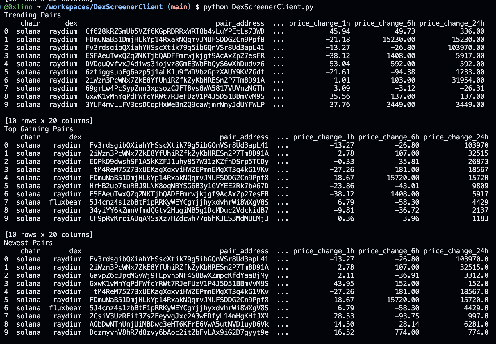

## V2 Message 
V2 is coming but firstly I have been working on a telegram bot and crypto API; after that is finished I'll see if Dexscreener API is even needed now. 

# Cryptocurrency Pair Analysis Tool
Cryptocurrency Pair Analysis Tool



## Overview
This Python tool is designed to analyze and manage cryptocurrency pair data from various blockchains. It retrieves trending, top gaining, and newest pairs, offering functionalities like generating files, printing data frames, and adding data to Supabase.

## Features
- **Blockchain Compatibility:** Works with multiple blockchains, defaulting to Solana.
- **Data Analysis:** Retrieves and analyzes data on cryptocurrency pairs.
- **File Generation:** Capable of generating files for further analysis or record-keeping.
- **Data Visualization:** Prints data frames for easy visualization.
- **Supabase Integration:** Option to add data to Supabase for centralized data management.

## Dependencies
- Ensure you have Python installed with necessary libraries for data handling and API requests.

## Usage

### Function: `i_am_the_watcher_free_version`
This is the main function of the tool. It allows users to specify the blockchain, control file generation, data frame printing, and Supabase integration.

#### Parameters:
- `chain` (str): The blockchain to retrieve data from (e.g., "solana", "bsc"). Default is "solana".
- `shouldGenerateFiles` (bool): If `True`, generates files based on the retrieved data. Default is `True`.
- `shouldPrintDataFrames` (bool): If `True`, prints the data frames. Useful for visualizing the data. Default is `False`.
- `shouldAddToSupabase` (bool): If `True`, adds the data to Supabase. Default is `False`.

#### Example Usage:
```python
i_am_the_watcher_free_version("bsc", shouldGenerateFiles=False, shouldPrintDataFrames=True, shouldAddToSupabase=False)
```

## Modules Description
- **consts:** Contains constants like slugged string pairs for various categories.
- **create_data_frame:** Functionality to create data frames from the retrieved data.
- **data_frames_array_print:** Prints array of data frames with labels.
- **generate_files:** Generates files from data frames.
- **get_newest_pairs, get_top_gaining_pairs, get_trending_pairs:** Retrieve newest, top gaining, and trending pairs from a specified blockchain.
- **pairs_loop:** Used for adding data to Supabase.

## Getting Started
1. Clone the repository.
2. Install required dependencies.
3. Run the script with desired parameters.

### Premium Version: Proposed Enhancements
The premium version of the tool would build upon the foundation laid by the free version, introducing advanced features and capabilities that cater to more sophisticated analysis and user needs. Here are some potential premium functionalities:

1. **Advanced Blockchain Support:** Enhanced compatibility with a wider range of blockchains, including lesser-known or emerging ones, providing broader market insights.

2. **Real-Time Data Streaming:** Integration of real-time data streaming for up-to-the-minute market analysis, crucial for fast-paced cryptocurrency markets.

3. **Automated Trading Signals:** Implementation of algorithms to generate trading signals based on the analysis of pair trends and performance.

4. **Customizable Alerts:** Personalized alert system for significant market movements, enabling users to act promptly on critical changes.

5. **Portfolio Integration:** Ability to link and analyze personal cryptocurrency portfolios, providing a tailored view of market movements relative to user holdings.

6. **Historical Data Analysis:** Access to extensive historical data, allowing for more profound and long-term trend analysis.

7. **Predictive Analytics:** Utilization of AI and machine learning models to forecast market trends and potential pair performances.

8. **Enhanced Data Visualization:** More sophisticated data visualization tools, including interactive charts and customizable dashboards.

9. **API Access:** Offering an API for integration with other tools or platforms, enabling automated data retrieval and analysis.

10. **Premium Support:** Dedicated customer support, including technical assistance and regular updates on new features or market trends.

11. **Educational Resources:** Access to exclusive educational content like webinars, tutorials, and market insights from experts.

12. **Community Access:** Entry into a community of users for networking, sharing strategies, and discussing market trends.

13. **Custom Report Generation:** Feature to create and export custom reports based on user-specific criteria and analysis needs.

14. **Enhanced Security Features:** Additional security layers for data protection, ensuring user data and analysis results remain confidential.

15. **Multi-Language Support:** Making the tool available in multiple languages to cater to a global user base.
